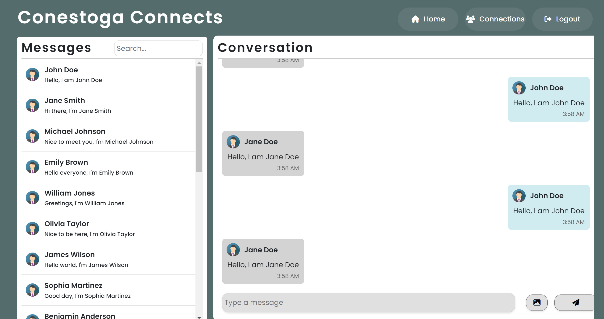
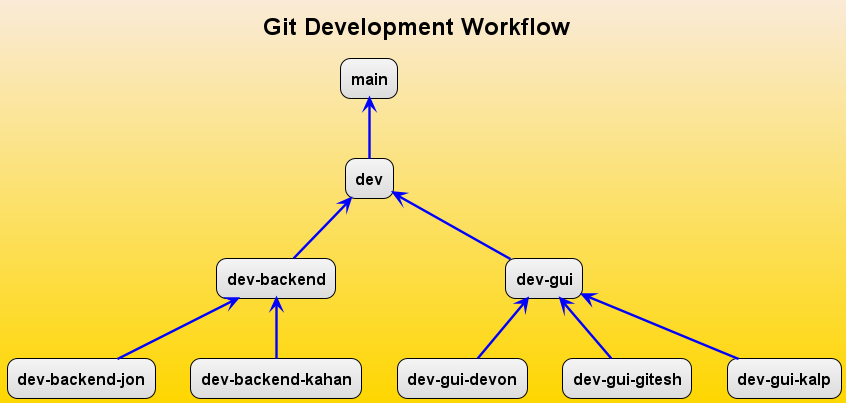

#### -- Group 7 presents... Project IV: --
# Conestoga Connects

## Table of Contents

1. [Introduction](#introduction)
2. [Features](#features)
3. [Technical Details](#technical-details)
4. [Contributing](#contributing)
5. [Development Notes](#development-notes)

## Introduction

The concept is to create a tailored peer networking platform, made by and for students of Conestoga College.

## Features

- create account
- login authentication
- messaging between users
- search for contacts

## Technical Details

- programmed in C# Blazor framework, using `Blazor Webassembly Standalone App` as template.
- MongoDB Atlas database
- testing with BUnit (for GUI), NUnit (For Server app), MSTest (For general unit testing), JMeter (performance and load testing), and Selenium WebDriver.

## Contributing

Please create your own branch as needed.  The diagram below should provide a useful guide to our workflow.
(Correction: Testing branch is downstream of dev, and not upstream as in the png file, which would be updated soon)

------------------------------------------------------------

## Development Notes

Solution startup notes:
Make sure to run the server project always!

Branch notes:
Main branch/ Master: Only has the final product once ready for deployment

Dev: has the latest working piece of code

Dev splits into Dev backend and Dev GUI, both of which are downstream to dev, and the names are pretty descriptive
These branches (dev-backend, dev-gui) are further split into individual branches of team members. This ensures a smooth workflow on the repository.

The testing branches are downstream of Dev too, and are only used for testing purposes, nothing else.

<I> This project was created as a part of the course: COMP72020 (Project IV: Mobile and Networked Systems) in Winter 2024 (Bachelor of Computer Science, Level 4) </I>

